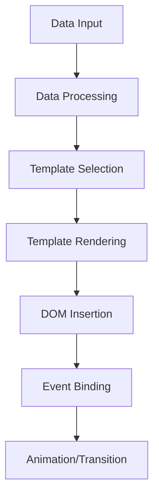

# Arquitectura de Renderitzat

Aquesta pàgina documenta l'arquitectura del sistema de renderitzat del Calendari IOC, explicant com es generen les vistes visuals, com funciona el sistema de templates i com es gestiona la renderització dinàmica de components.

## Visió General del Renderitzat

El **sistema de renderitzat** del Calendari IOC està basat en un patró híbrid que combina renderització imperativa amb components reutilitzables, optimitzat per a rendiment i flexibilitat sense dependències externes de frameworks.

### Principis Arquitectònics

**Renderització sob demanda**: Components es renderitzen només quan són necessaris
**Reutilització de components**: Templates i lògica reutilitzables
**Separació de concerns**: Dades, lògica i presentació separades
**Performance first**: Optimitzacions per minimitzar reflows i repaints

## Capes del Sistema de Renderitzat

### 1. Capa de Vista (View Layer)

La capa superior que gestiona les diferents vistes del calendari.

```
views/
├── CalendarRenderer.js     # Classe base per renderitzadors
├── MonthViewRenderer.js    # Vista mensual
├── WeekViewRenderer.js     # Vista setmanal  
├── DayViewRenderer.js      # Vista diària
├── SemesterViewRenderer.js # Vista semestral
└── GlobalViewRenderer.js   # Vista global
```

#### Patró d'Herència

```javascript
// Jerarquia de classes de renderitzat
CalendarRenderer (base)
├── MonthViewRenderer
├── WeekViewRenderer  
├── DayViewRenderer
├── SemesterViewRenderer
└── GlobalViewRenderer
```

### 2. Capa de Components (Component Layer)

Components reutilitzables per a elements específics de la UI.

```
ui/
├── ModalRenderer.js        # Sistema de modals
├── PanelsRenderer.js       # Panells laterals
└── ComponentFactory.js     # Factory per components
```

### 3. Capa de Templates (Template Layer)

Sistema de templates per generar HTML dinàmic.

```javascript
// Exemple de template per esdeveniment
const EVENT_TEMPLATE = `
<div class="event" data-event-id="{eventId}" style="background-color: {categoryColor}">
    <span class="event-title">{title}</span>
    <span class="event-time">{time}</span>
</div>
`;
```

## Flux de Renderitzat

### 1. Iniciació de Renderitzat

```javascript
// Seqüència típica de renderitzat
1. ViewManager.switchToView('month')
2. MonthViewRenderer.render(container, calendar, events)
3. Template generation amb dades
4. DOM manipulation i inserció
5. Event listeners attachment
6. Animation/transition si cal
```

### 2. Pipeline de Renderitzat



## Sistema de Templates

### Template Engine Personalitzat

```javascript
class TemplateEngine {
    static render(template, data) {
        return template.replace(/{(\w+)}/g, (match, key) => {
            return data[key] || '';
        });
    }
    
    static renderList(template, dataArray) {
        return dataArray.map(data => this.render(template, data)).join('');
    }
    
    static renderConditional(template, data, condition) {
        return condition(data) ? this.render(template, data) : '';
    }
}
```

### Templates de Components

#### Template d'Esdeveniment

```javascript
const EVENT_TEMPLATES = {
    standard: `
        <div class="event event-{type}" 
             data-event-id="{id}"
             data-category-id="{categoryId}"
             style="background-color: {categoryColor}">
            <div class="event-header">
                <span class="event-title">{title}</span>
                {timeDisplay}
            </div>
            {descriptionDisplay}
        </div>
    `,
    
    compact: `
        <div class="event event-compact" data-event-id="{id}">
            <span class="event-dot" style="background-color: {categoryColor}"></span>
            <span class="event-title">{title}</span>
        </div>
    `,
    
    detailed: `
        <div class="event event-detailed" data-event-id="{id}">
            <div class="event-category" style="background-color: {categoryColor}">
                {categoryName}
            </div>
            <div class="event-content">
                <h4 class="event-title">{title}</h4>
                <div class="event-time">{timeDisplay}</div>
                <div class="event-description">{description}</div>
            </div>
        </div>
    `
};
```

#### Template de Grid Calendari

```javascript
const CALENDAR_GRID_TEMPLATE = `
<div class="calendar-grid">
    <div class="calendar-header">
        {monthNavigation}
        <h2 class="calendar-title">{monthYear}</h2>
        {viewControls}
    </div>
    <div class="calendar-weekdays">
        {weekdayHeaders}
    </div>
    <div class="calendar-days">
        {daysCells}
    </div>
</div>
`;
```

### Sistema de Slots

```javascript
// Sistema per insertion de contingut dinàmic
class SlotSystem {
    static registerSlot(name, renderer) {
        this.slots.set(name, renderer);
    }
    
    static renderSlot(name, data) {
        const renderer = this.slots.get(name);
        return renderer ? renderer(data) : '';
    }
}

// Exemple d'ús
SlotSystem.registerSlot('eventActions', (event) => `
    <div class="event-actions">
        <button onclick="editEvent('${event.id}')">Editar</button>
        <button onclick="deleteEvent('${event.id}')">Eliminar</button>
    </div>
`);
```

## Gestió del DOM

### Virtual DOM Simplificat

```javascript
class SimpleVirtualDOM {
    constructor() {
        this.vNodes = new Map();
    }
    
    createElement(type, props, children) {
        return {
            type,
            props: props || {},
            children: children || [],
            key: props?.key
        };
    }
    
    render(vNode, container) {
        const element = this.createDOMElement(vNode);
        container.appendChild(element);
        return element;
    }
    
    diff(oldVNode, newVNode) {
        // Algoritme de diffing simplificat
        if (this.needsUpdate(oldVNode, newVNode)) {
            return this.createUpdatePatch(oldVNode, newVNode);
        }
        return null;
    }
}
```

### Batch Updates

```javascript
class RenderBatch {
    constructor() {
        this.pending = [];
        this.scheduled = false;
    }
    
    schedule(renderFn) {
        this.pending.push(renderFn);
        
        if (!this.scheduled) {
            this.scheduled = true;
            requestAnimationFrame(() => this.flush());
        }
    }
    
    flush() {
        this.pending.forEach(fn => fn());
        this.pending = [];
        this.scheduled = false;
    }
}
```

## Optimitzacions de Performance

### 1. Lazy Rendering

```javascript
class LazyRenderer {
    static renderWhenVisible(element, renderFn) {
        const observer = new IntersectionObserver((entries) => {
            entries.forEach(entry => {
                if (entry.isIntersecting) {
                    renderFn();
                    observer.unobserve(element);
                }
            });
        });
        
        observer.observe(element);
    }
}
```

### 2. Component Caching

```javascript
class ComponentCache {
    constructor() {
        this.cache = new Map();
    }
    
    get(key) {
        return this.cache.get(key);
    }
    
    set(key, component) {
        // LRU cache amb límit de mida
        if (this.cache.size > 100) {
            const firstKey = this.cache.keys().next().value;
            this.cache.delete(firstKey);
        }
        this.cache.set(key, component);
    }
    
    invalidate(pattern) {
        for (const key of this.cache.keys()) {
            if (key.includes(pattern)) {
                this.cache.delete(key);
            }
        }
    }
}
```

### 3. Debounced Rendering

```javascript
class DebouncedRenderer {
    constructor(delay = 16) {
        this.delay = delay;
        this.pending = new Map();
    }
    
    render(key, renderFn) {
        clearTimeout(this.pending.get(key));
        
        this.pending.set(key, setTimeout(() => {
            renderFn();
            this.pending.delete(key);
        }, this.delay));
    }
}
```

## Sistema d'Esdeveniments de Renderitzat

### Lifecycle Events

```javascript
class RenderLifecycle {
    static events = ['beforeRender', 'render', 'afterRender', 'beforeUpdate', 'update', 'afterUpdate'];
    
    static emit(event, data) {
        document.dispatchEvent(new CustomEvent(`render:${event}`, { detail: data }));
    }
    
    static on(event, callback) {
        document.addEventListener(`render:${event}`, callback);
    }
}

// Exemple d'ús
RenderLifecycle.on('beforeRender', (e) => {
    console.log('About to render:', e.detail);
});
```

### Hook System

```javascript
class RenderHooks {
    static hooks = new Map();
    
    static register(name, hook) {
        if (!this.hooks.has(name)) {
            this.hooks.set(name, []);
        }
        this.hooks.get(name).push(hook);
    }
    
    static execute(name, data) {
        const hooks = this.hooks.get(name) || [];
        return hooks.reduce((result, hook) => hook(result), data);
    }
}

// Exemple d'ús
RenderHooks.register('processEventData', (event) => {
    // Afegir dades calculades
    event.displayTime = formatTime(event.startTime, event.endTime);
    return event;
});
```

## Responsive Rendering

### Breakpoint System

```javascript
class ResponsiveRenderer {
    static breakpoints = {
        mobile: 768,
        tablet: 1024,
        desktop: 1200
    };
    
    static getCurrentBreakpoint() {
        const width = window.innerWidth;
        if (width < this.breakpoints.mobile) return 'mobile';
        if (width < this.breakpoints.tablet) return 'tablet';
        if (width < this.breakpoints.desktop) return 'desktop';
        return 'wide';
    }
    
    static renderForBreakpoint(component, breakpoint) {
        const templates = component.getTemplates();
        return templates[breakpoint] || templates.default;
    }
}
```

### Adaptive Components

```javascript
class AdaptiveComponent {
    constructor(element) {
        this.element = element;
        this.currentBreakpoint = null;
        this.setupResizeObserver();
    }
    
    setupResizeObserver() {
        const resizeObserver = new ResizeObserver((entries) => {
            for (const entry of entries) {
                this.handleResize(entry.contentRect);
            }
        });
        
        resizeObserver.observe(this.element);
    }
    
    handleResize(rect) {
        const newBreakpoint = this.getBreakpointForWidth(rect.width);
        
        if (newBreakpoint !== this.currentBreakpoint) {
            this.currentBreakpoint = newBreakpoint;
            this.rerender();
        }
    }
}
```

## Accessibilitat en Renderitzat

### ARIA Integration

```javascript
class AccessibleRenderer {
    static addARIALabels(element, data) {
        if (data.title) element.setAttribute('aria-label', data.title);
        if (data.description) element.setAttribute('aria-describedby', `desc-${data.id}`);
        if (data.isSelected) element.setAttribute('aria-selected', 'true');
    }
    
    static ensureKeyboardNavigation(container) {
        const focusableElements = container.querySelectorAll('[tabindex], button, input, select, textarea, a[href]');
        
        focusableElements.forEach((el, index) => {
            if (!el.hasAttribute('tabindex')) {
                el.setAttribute('tabindex', '0');
            }
        });
    }
}
```

### Screen Reader Support

```javascript
class ScreenReaderSupport {
    static announceChange(message) {
        const announcement = document.createElement('div');
        announcement.setAttribute('aria-live', 'polite');
        announcement.setAttribute('aria-atomic', 'true');
        announcement.classList.add('sr-only');
        announcement.textContent = message;
        
        document.body.appendChild(announcement);
        
        setTimeout(() => {
            document.body.removeChild(announcement);
        }, 1000);
    }
    
    static describePage(pageInfo) {
        const description = `Calendari ${pageInfo.type}, ${pageInfo.month} ${pageInfo.year}, ${pageInfo.eventsCount} esdeveniments`;
        this.announceChange(description);
    }
}
```

## Error Handling en Renderitzat

### Render Error Boundaries

```javascript
class RenderErrorBoundary {
    static wrap(renderFn, fallbackFn) {
        return (...args) => {
            try {
                return renderFn(...args);
            } catch (error) {
                console.error('Render error:', error);
                this.reportError(error, args);
                return fallbackFn ? fallbackFn(...args) : this.getErrorFallback();
            }
        };
    }
    
    static getErrorFallback() {
        return '<div class="render-error">Error de renderitzat</div>';
    }
    
    static reportError(error, context) {
        // Enviar error a sistema de monitoring
        if (window.errorReporting) {
            window.errorReporting.logRenderError(error, context);
        }
    }
}
```

Aquesta arquitectura de renderitzat proporciona un sistema flexible, performant i extensible per gestionar tota la presentació visual del Calendari IOC, mantenint la simplicitat mentre ofereix funcionalitats avançades per a una experiència d'usuari òptima.

---
[← Arquitectura d'Estat](Arquitectura-d-Estat) | [Decisions de Disseny →](Decisions-de-Disseny-i-Justificacions)