# Diagrames d'Arquitectura

Aquesta pàgina conté diagrames visuals que il·lustren l'arquitectura del Calendari IOC, facilitant la comprensió de les relacions entre components, el flux de dades i l'organització general del sistema.

## Diagrama d'Arquitectura General

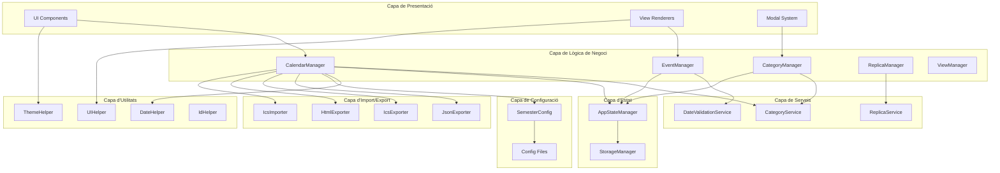

## Diagrama de Flux de Dades

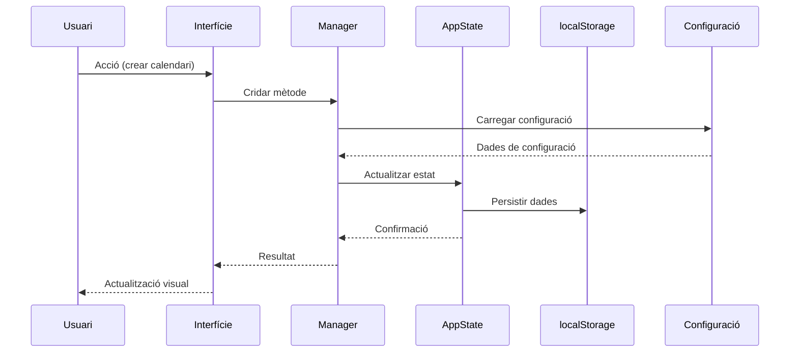

## Diagrama de Components UI

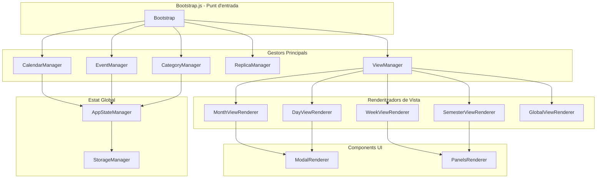

## Diagrama de Jerarquia de Classes

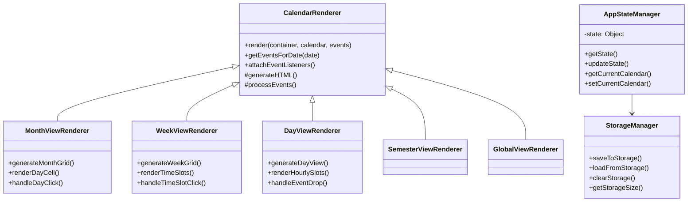

## Diagrama de Patrons de Disseny

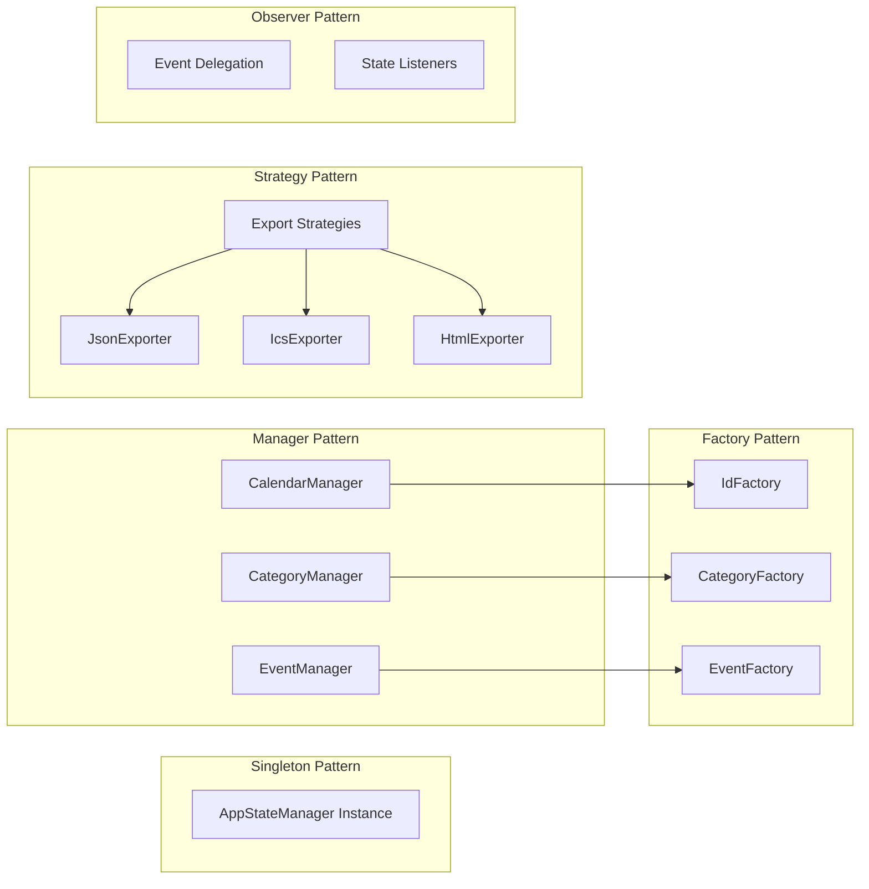

## Diagrama de Sistema de Configuració

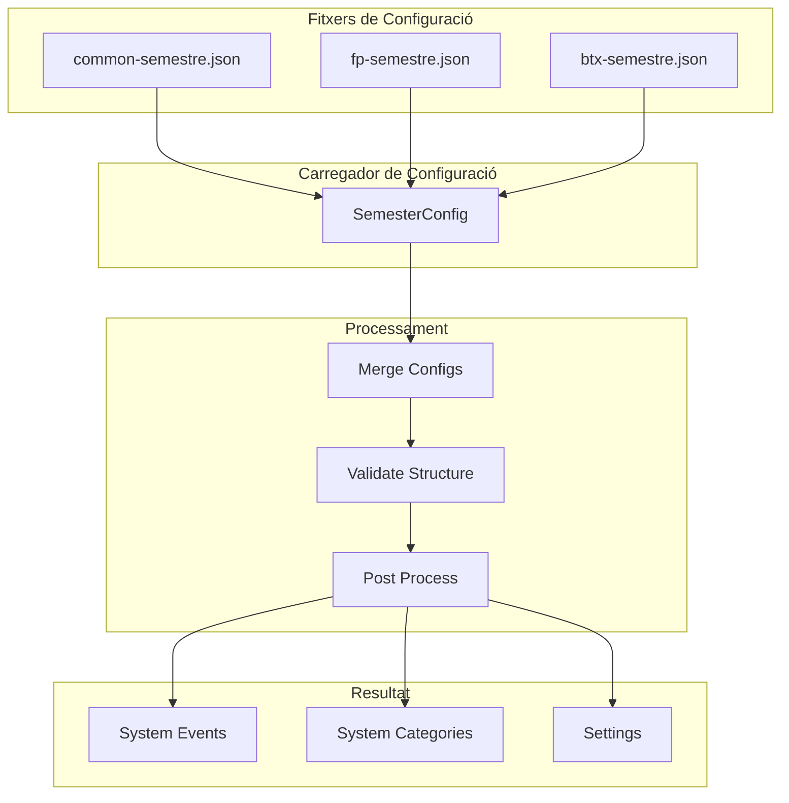

## Diagrama de Flux de Replicació

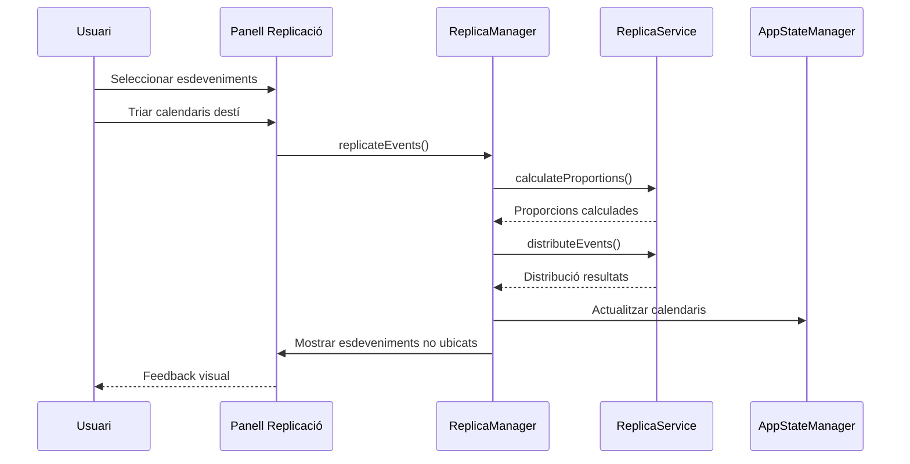

## Diagrama de Gestió d'Esdeveniments

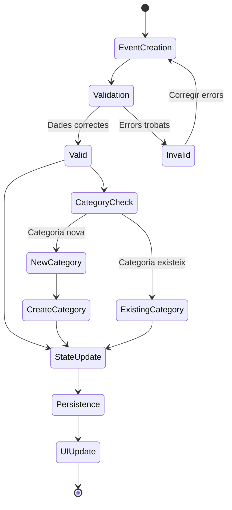

## Diagrama de Sistema de Temes

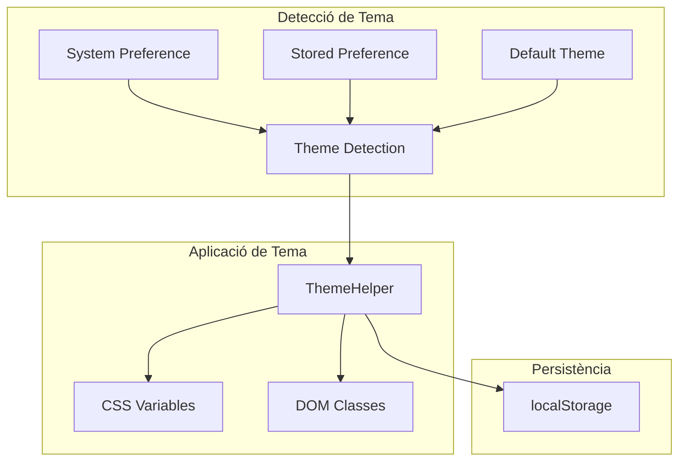

## Diagrama de Flux d'Import ICS

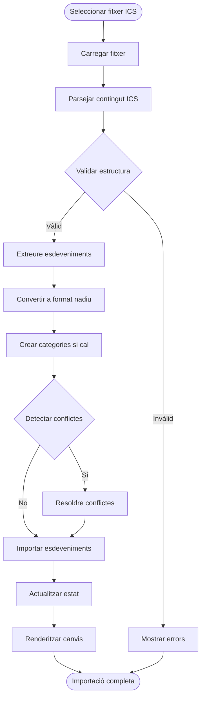

## Diagrama de Arquitectura de Dades

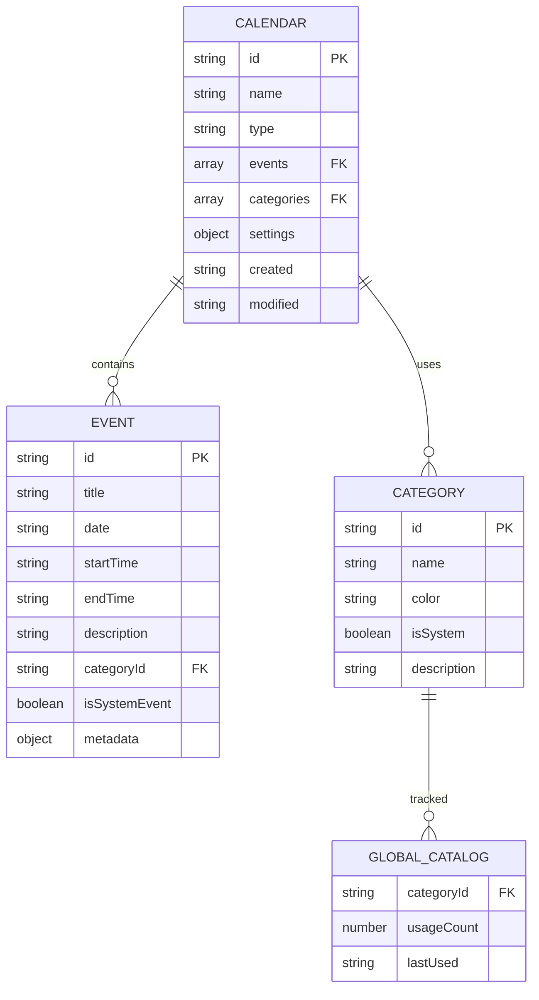

## Diagrama de Rendiment i Optimització

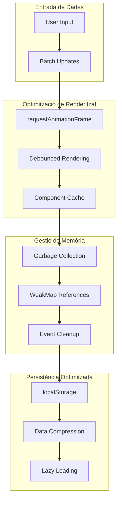

Aquests diagrames proporcionen una comprensió visual completa de l'arquitectura del Calendari IOC, mostrant les relacions entre components, el flux de dades i els patrons de disseny implementats per facilitar el desenvolupament i manteniment del sistema.

---
[← Decisions de Disseny i Justificacions](Decisions-de-Disseny-i-Justificacions) | [Managers Referència →](managers-Referència)